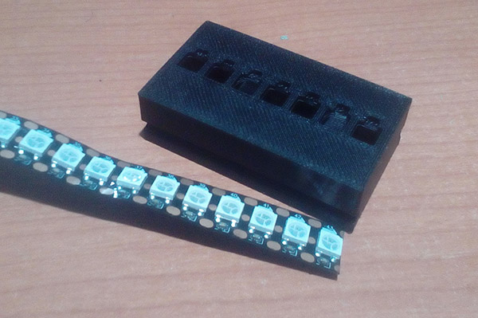
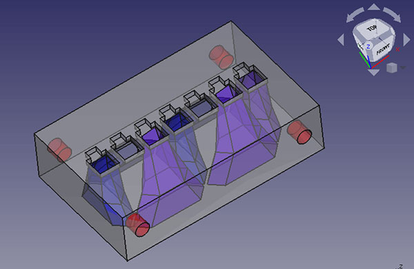

# BIG Digit 7 Segmentos 3D

Display 7 segmentos para imprimir en 3D.

Permite crear digitos de 7 segmentos iluminados con tira de leds direccionable, de manera que solo necesitamos ocupar una salida del microcontrolador.

Es posible concatenar varios digitos.

En el ejemplo de la carpeta firmware se incluyen rutinas que usan hasta 4 displays y ejemplos para mostrar contadores, temperaturas y desplazamientos de mensajes de texto.

Se incluye el fichero STL. 

El tamaño de display del ejemplo esta preparado para usar tiras de leds de 144 pixels por metro 
de manera que se minimizan las soldaduras reduciendose estas solo a las conexiones entre digitos.

Se nos genera de esta manera un display de 55mm de alto por 35mm de ancho.

Si se usan multiples displays el acceso a los digitos será de derecha a izquierda, es decir primero las unidades.
Dentro de cada display el orden de los segmentos es el siguiente:

**Modelo 3D**

   

          

Si se imprime en la posicion que muestra la imagen se evitan los soportes 
(salvo una minima parte que corresponde a los agujeros que se usan para la union entre digitos)

  

**Ejemplo de un reloj**

 

**Notas**

 - Si se usan simbolos especiales como es el caso de los dos puntos de separacion en el reloj de la imagen superior, 
estos deben crearse con pixeles del final de la tira leds, es decir tras la formacion de todos los digitos,
para poder mantener la compatibilidad con las funciones usadas en los ejemplos de la carpeta firmware.

 - Los digitos deberan cubrirse en su parte frontal con una lamina de un material translucido )papel, cinta de carrocero...) 
para obtener un efecto de iluminacion adecuado.
